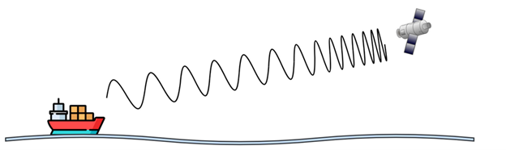

# Comunicaciones de Datos - Trabajo Práctico N° 2

**Nombres**  
_Gianluca Ferraris; Ezequiel J. Marredo; Juan M. Painenao; Alejandro R. Stangaferro;_  
**Xi JinPING**

**Facultad de Ciencias Exactas, Físicas y Naturales**  
**Comunicaciones de Datos**
**Profesores**
_Facundo O. Cuneo; Santiago M. Henn;_
**08-09-2025**

---

### Información de los autores
 
- **Información de contacto**: _gianlucaferraris@mi.unc.edu.ar; ezequiel.marredo@mi.unc.edu.ar; juanpainenao@mi.unc.edu.ar; alejandro.stangaferro@mi.unc.edu.ar;_  

---

## Resumen
Este trabajo aborda conceptos fundamentales de las comunicaciones de datos, analizando el efecto Doppler, el ruido electromagnético y la relación señal-ruido (SNR) en distintas modulaciones. Se estudió la estructura de tramas Ethernet y medios físicos como el cable UTP, y se aplicó la herramienta Wireshark para capturar y examinar tráfico real de red. Finalmente, se compararon identificadores como IMEI y MAC, junto con el rol de las VPN en la seguridad.


**Palabras clave**: _Efecto Doppler, Ruido Electromagnético, SNr, WireShark, IP_

---

## Introducción
En el estudio de redes de computadoras y comunicaciones de datos, es necesario comprender la estructuración y comunicación de los diferentes niveles que conforman el modelo de referencia OSI. El trabajo tiene como objetivo repasar y profundizar conceptos, funciones y características técnicas de la Capa Física (nivel 1).
Luego, se abordarán los principios básicos de la Capa de Enlace de Datos (nivel 2), cuya función es garantizar una comunicación libre de errores entre dispositivos conectados en una misma red física, mediante tramas, uso de direcciones MAC y mecanismos de control de flujo y errores.
Finalmente, se realizará una práctica con la herramienta Wireshark, útil para inspeccionar y diagnosticar el tráfico de red.

## Resultados
### Consigna 1


a) El fenómeno físico que se encuentra en la figura es el efecto Doppler, el cual consiste en la variación de la frecuencia aparente debido al movimiento relativo del emisor respecto del receptor.
Se describe con la siguiente formula:

$$
fr = \left( \frac{c + v_r}{c + v_t} \right) ft
$$

Donde:

fr : Frecuencia del receptor
ft : Frecuencia del transmisor
c : Velocidad de la luz (3e8 m/s)
vr : Velocidad del receptor (Positiva si se acerca)
vt : Velocidad del transmisor (Positiva si se aleja)

Se pueden determinar las siguientes conclusiones:
- Si el transmisor se acerca del receptor (vt positiva) la frecuencia recibida aumenta.
- Si el receptor se aleja del transmisor (vr negativa) la frecuencia que recibe el menor.
- En el caso de que se desee recibir la misma frecuencia transmitida, es necesario que tanto transmisor como receptor viajen a la misma velocidad con igual sentido.

b) Recordando las bandas de transmisión vistas en el trabajo practico 1, los tipos de transmisión mas afectados por este fenómeno son los que comprenden tanto receptores como transmisores en velocidades relativas considerables. Como pueden ser las frecuencias de las bandas SHF y EHF, utilizadas principalmente para radio y comunicaciones satelitales.

c) Las principales razones por las cuales no se debe encender el celular arriba de un avión son: 
- Interferencia electromagnética: Debido a que un teléfono transmite a alta potencia cuando busca red esto puede causar interferencia o desensibilizar receptores sensibles, incluso cuando no utilizan las mismas bandas electromagnéticas
- Carga en la red terrestre: Los celulares en tierra se conectan a la estación base (celda) más cercana y si el usuario se mueve fuera del alcance de dicha red, la red hace un handover y pasa tu conexión a otra celda. Dentro de un avión, debido a la gran altitud, el celular puede detectar varias celdas a la vez y registrarse en todas, por lo que puede cargar e interferir en la red.
- Movimiento a altas velocidades: Las redes celulares están pensadas para movimientos terrestres. Las altas velocidades de un avión generan efecto Doppler por lo que se complica la sincronización y handover.

### Consigna 2

a) El fenómeno físico observado es el ruido electromagnético. El mismo se suma a la señal que viaja por el aire y distorsiona la forma de la onda. El mismo no es determinista, es aleatorio y se modela como un proceso estocástico con una media constante.

b) Como el ruido se suma a la señal, el mismo afecta mas a las modulaciones por amplitud, como AM, ASK. En cambio, en modulaciones como FSK, PSK, donde la información se encuentra en la frecuencia el ruido no afecta tanto.

c) La SNR o relación señal a ruido, es el cociente entre la potencia de señal sobre la potencia de ruido. La misma indica cuanto mayor es la señal por sobre el ruido. Si se relaciona directamente con el BER, aunque depende de la modulación implementada, pero es común que a mayor SNR se tenga un BER cada vez menor, ya que la señal es más inmune a las interferencias del ruido.

$$
SNR = \frac{P_{señal}}{P_{ruido}}
$$


### Consigna 3

Se utilizó **WireShark** para analizar el trafico de red de mi internet local. Los paquetes capturados fueron exportados en formato *.pcapng* utilizando la opción de exportación de Wireshark (Archivo → Exportar paquetes especificados), seleccionando la opción 'Todos los paquetes' y guardando el archivo sin compresión en la carpeta de Documentos.

a) Ethernet es un conjunto de protocolos de red cableada que permite a distintos dispositivos como computadoras, servidores comunicarse y compartir datos de manera rápida y fiable. Utiliza cables (RJ45) para crear una red local o conectarse a Internet, ofreciendo mayor velocidad, seguridad y estabilidad en comparación con las redes inalámbricas como el Wi-Fi. Estos protocolos son útiles para compartir datos entre dispositivos conectados a una misma red.
La estructura de una trama Ethernet se compone de los siguientes campos:

| Campo                   | Longitud (bytes) | Descripción                                                                 |
|-------------------------|------------------|-----------------------------------------------------------------------------|
| **Preamble**            | 7                | Patrón de sincronización (101010... repetido) para que el receptor se ajuste |
| **Start Frame Delimiter (SFD)** | 1        | Indica el inicio de la trama (10101011)                                     |
| **Dirección MAC destino** | 6              | Identifica al dispositivo receptor (unívoco en la red local)                 |
| **Dirección MAC origen** | 6               | Identifica al dispositivo emisor                                            |
| **Tipo / Ethertype**    | 2                | Indica protocolo de capa superior (IPv4 = 0x0800, ARP = 0x0806, etc.)        |
| **Datos / Payload**     | 46 – 1500        | Contiene los datos de capa superior (por ejemplo un paquete IP)              |
| **FCS (Frame Check Sequence)** | 4         | Secuencia de verificación (CRC-32) para detectar errores en la trama         |

b) El **cable UTP (Unshielded Twisted Pair)** es un medio físico de transmisión formado por pares de conductores de cobre trenzados entre sí, sin blindaje metálico adicional. Su diseño responde directamente a la necesidad de reducir los efectos del ruido electromagnético explicado en la Consigna 2.a). El trenzado de los pares hace que las interferencias externas afecten de manera casi idéntica a ambos conductores, generando una cancelación parcial de dicho ruido (principio de rechazo de modo común).

En relación con la Consigna 2, el UTP busca justamente mejorar la SNR (relación señal a ruido) de la transmisión:

- Al disminuir la captación de interferencias externas, se reduce la potencia de ruido $P_{ruido}$. De esta forma, el cociente: $$
SNR = \frac{P_{señal}}{P_{ruido}}
$$ se incrementa, aumentando la inmunidad del sistema frente a errores y disminuyendo el BER (Bit Error Rate).

- Esto resulta fundamental para técnicas de modulación basadas en amplitud, como ASK o AM, que son más vulnerables al ruido, tal como se discutió en el ítem 2.b).

**Diferencia entre cable derecho y cable cruzado**

- *Cable derecho* (straight-through): conecta dispositivos de distinto tipo (PC ↔ Switch, Switch ↔ Router). Los pares están conectados de manera directa en ambos extremos (pin 1 con pin 1, pin 2 con pin 2, etc.).

- *Cable cruzado* (crossover): conecta dispositivos del mismo tipo (PC ↔ PC, Switch ↔ Switch). En este caso se cruzan los pares de transmisión y recepción (pin 1 con pin 3, pin 2 con pin 6).

Hoy en día, con la función **Auto MDI-X** incorporada en la mayoría de equipos modernos, esta distinción pierde importancia, ya que el dispositivo puede detectar automáticamente si debe invertir los pares.

c) Para este ítem primero se identificó la puerta de enlace predeterminada de la conexión. En este caso, la dirección corresponde a: ```192.168.1.1```. La comprobación se realizó mediante el comando ```ipconfig``` (Windows) o ```ifconfig``` (Linux), que muestra la configuración de red activa en el dispositivo. Una vez identificada la dirección IP de la puerta de enlace, se procedió a generar tráfico hacia ella utilizando la instrucción: ```ping 192.168.1.1```. Este comando envía mensajes ICMP tipo Echo Request al gateway, esperando como respuesta mensajes ICMP tipo Echo Reply. En paralelo, se abrió Wireshark en la interfaz de red correspondiente y se aplicó el siguiente filtro de captura: ```icmp && ip.addr == 192.168.1.1```. De esta forma se visualizaron únicamente los paquetes ICMP intercambiados entre el host y la puerta de enlace.
Luego, se analizó en detalle uno de los paquetes ICMP tipo Echo Request capturados en Wireshark.
**Encabezado IP (IPv4):**
- Versión: 4 (IPv4).
- Longitud de encabezado: 20 bytes.
- Dirección IP de origen: 192.168.1.15 (host local).
- Dirección IP de destino: 192.168.1.1 (puerta de enlace).
- Protocolo: ICMP (valor 1).
- TTL (Time to Live): 128 saltos.
- Checksum: 0xf96 (sin errores).

**Encabezado ICMP:**
- Tipo: 8 → Echo (ping) request.
- Código: 0.
- Checksum: 0x4c7f (correcto).
- Identificador: 1.
- Número de secuencia: 220 (0x00dc).
- Datos transportados: 32 bytes.
- Representación en hexadecimal

Del mismo paquete, Wireshark permite obtener la representación en hexadecimal. Un extracto de los primeros bytes de este paquete ICMP se observa de la siguiente manera (cada byte expresado en formato hexadecimal):

```
45 00 00 3c a7 ca 00 00 80 01 0f 96 c0 a8 01 0f
c0 a8 01 01 08 00 4c 7f 01 00 00 dc 61 62 63 64
65 66 67 68 69 6a 6b 6c 6d 6e 6f 70 71 72 73 74
75 76 77 61 62 63 64 65 66 67 68
```
En esta estructura:
- Los primeros 20 bytes corresponden al encabezado IPv4.
- Los siguientes 8 bytes son del encabezado ICMP.
- Finalmente, los 32 bytes restantes corresponden a los datos enviados en el ping.

d) A través de WireShark y filtrando a través de la palabra clave ```eth``` se puede ver la dirección MAC address tanto de origen como destino. Estas son:
- MAC de origen: ```74:3a:f4:f6:71:92```
- MAC de destino: ```f0:c4:78:83:97:dc```

Analizando los primeros tres bytes de la MAC de destino podemos saber (buscando a través de páginas como Macvendors) los datos del fabricante. En nuestro caso, corresponde a **Huawei Technologies CO, LTD**.

e) 

#### IPCONFIG
```
Wireless LAN adapter Wi-Fi:

   Connection-specific DNS Suffix  . : fibertel.com.ar
   Link-local IPv6 Address . . . . . : fe80::e4c5:efa3:c904:7deb%8
   IPv4 Address. . . . . . . . . . . : 192.168.0.208
   Subnet Mask . . . . . . . . . . . : 255.255.255.0
   Default Gateway . . . . . . . . . : 192.168.0.1
```

#### Datos del paquete

```
48 5f 99 aa 77 10  3c 97 0e 4a 12 b1  08 00  45 00
00 3c  1c 46  40 00  40 01  a6 ec  c0 a8 01 19  c0 a8
01 0f  00 00  08 00  4d 5d  00 01  00 6b  61 62 63 64
65 66 67 68  69 6a 6b 6c  6d 6e 6f 70  71 72 73 74 75
76 77 61 62  63 64 65 66  67 68
```

#### Mac
Huawei Technologies CO, LTD


### Consigna 4
En base a las prácticas e investigación realizada, aunque el contenido de las comunicaciones puede estar protegido por cifrado, las direcciones IP y MAC siguen expuestas y permiten la trazabilidad de los dispositivos conectados en la red. Por lo tanto, la privacidad y seguridad depende tanto de los protocolos utilizados como medidas adicionales aplicadas por el usuario y el sistema operativo.

La Media Access Control (MAC) es un identificador único de 12 dígitos hexadecimales asignado a la tarjeta de red (Wi-Fi, Ethernet, Bluetooth). Sirve para identificar un dispositivo dentro de una red local. La MAC es posible cambiarla mediante un modo llamado MAC spoofing o utilizando una máquina virtual.

Por otro lado, para dispositivos móviles existe el International Mobile Equipment Identity (IMEI), el cual es un número único de 15 dígitos que se le asigna a cada dispositivo móvil en el momento de fabricación. Este código sirve como identificador del dispositivo nivel mundial y como método de autenticación para los dispositivos que se conectan a las redes de telefonía móvil.
Este código se encuentra grabado en el hardware del dispositivo y no es posible cambiarlo.


En suma, ambos son identificadores únicos de hardware, pero el IMEI funciona a nivel de red móvil global, mientras que la MAC funciona a nivel de red local.

Para dificultar la trazabilidad de los dispositivos, se puede utilizar una Virtual Private Network (VPN), la cual es una tecnología que oculta la dirección IP pública, cifrando el tráfico y creando una conexión segura al momento de navegar por Internet. Sin embargo, la VPN no oculta la dirección MAC, ya que trabaja en un nivel diferente del modelo de red (nivel de enlace de datos), mientras que la VPN actúa en el nivel de red principalmente.


## Referencias  

- Stallings, W. (2004). *Comunicaciones y redes de computadores* (7ª ed.). Pearson Prentice Hall. [https://drive.google.com/file/d/1xmuElCwHET1hQMLfMAqdAfYax0biOwZl/view?usp=sharing](https://drive.google.com/file/d/1xmuElCwHET1hQMLfMAqdAfYax0biOwZl/view?usp=sharing)   
- Ariat Tech. (2023). *The radio spectrum: Understanding ITU frequency bands from VLF to UHF*. Recuperado de [https://www.ariat-tech.es/blog/the-radio-spectrum-understanding-itu-frequency-bands-from-vlf-to-uhf.html](https://www.ariat-tech.es/blog/the-radio-spectrum-understanding-itu-frequency-bands-from-vlf-to-uhf.html)  
- Wikipedia. (s. f.). *Efecto Doppler*. En **Wikipedia en español**. Recuperado de [https://es.wikipedia.org/wiki/Efecto_Doppler](https://es.wikipedia.org/wiki/Efecto_Doppler)  
- EA1URO. (s. f.). *Doppler y Satélites*. Recuperado de [https://www.ea1uro.com/eb1dgh/Satelites/Doppler.html](https://www.ea1uro.com/eb1dgh/Satelites/Doppler.html)  
